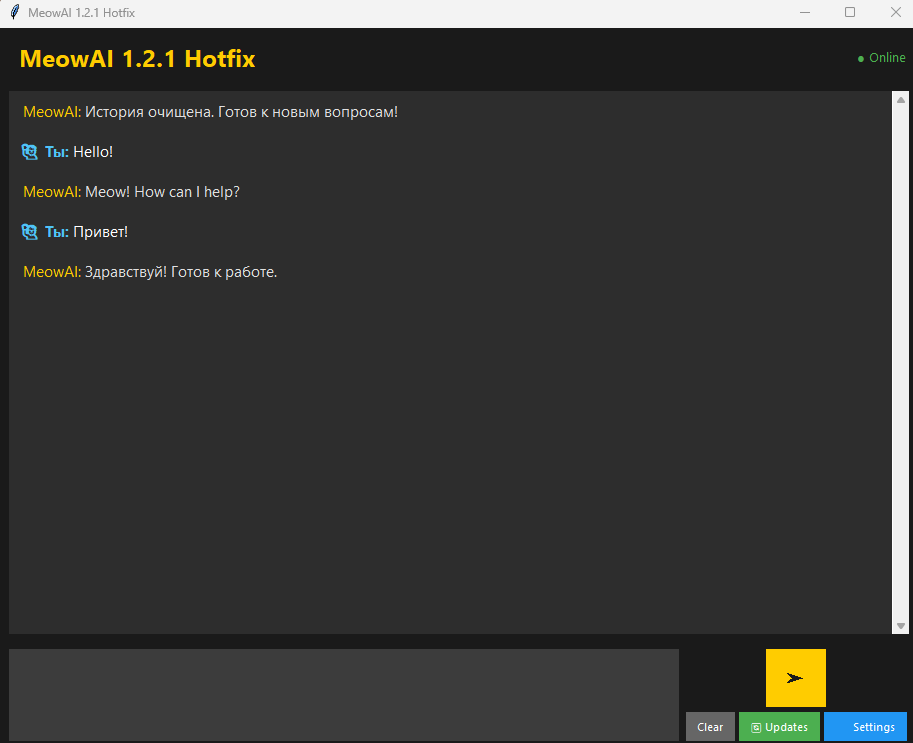

<!-- Иконки и виджеты -->

  
  
  
  
  

<h1 align="center">🐱 MeowAI v1.2.1 — Multilingual Edition</h1>

  <strong>Умный ИИ-помощник с характером. Теперь говорит на русском и английском, проверяет обновления и понимает контекст.</strong>

  Разработчик: <b>matvey2222222222</b>

## ️ ВАЖНОЕ ПРЕДУПРЕЖДЕНИЕ (v1.2.1)

> **Функция смены языка находится в стадии тестирования.**  
> Переключение между RU и EN может работать некорректно в некоторых сценариях (например, история чата может отображаться на старом языке, или поиск в Википедии может не переключиться автоматически).  
> Если вы столкнулись с проблемами после смены языка — просто перезапустите приложение. Мы работаем над полной стабилизацией этой функции в следующих обновлениях.

---

##  О проекте

**MeowAI** — это интеллектуальный десктопный ассистент с графическим интерфейсом. Он не просто копирует текст из интернета, а анализирует запрос, фильтрует рекламный шум и выделяет самую суть ответа. Программа сохраняет историю диалогов и найденные факты в локальную базу, чтобы при повторных вопросах отвечать мгновенно.

В версии **1.2.1** добавлена полноценная поддержка двух языков (RU/EN) с возможностью переключения прямо в интерфейсе через меню настроек.

## ✨ Возможности версии 1.2.1

- ** Мультиязычность (Beta)** — полный перевод интерфейса, ответов бота и поисковых запросов. Поддержка русского и английского языков с сохранением настроек.
- ** Умный анализ запросов** — использует нечеткое сравнение (fuzzy matching), чтобы понимать вопросы даже с опечатками или измененным порядком слов.
- **💬 Живой характер** — бот отвечает естественно, избегая шаблонных фраз. Поддерживает контекст беседы и помнит, о чем вы говорили ранее.
- **🧮 Встроенный калькулятор** — решает математические выражения мгновенно, не обращаясь к поисковикам.
- ** Двойной поиск** — использует Википедию как основной источник фактов и DuckDuckGo для дополнительных данных, жестко фильтруя спам и код.
- **🔄 Автопроверка обновлений** — встроенная система проверяет GitHub Releases и уведомляет о выходе новых версий прямо в чате.
- **️ Меню настроек** — удобное модальное окно для управления языком и другими параметрами (в разработке).
- **💾 Локальная память** — вся история и база знаний хранятся в `%APPDATA%\MeowAI`. Данные не теряются при обновлении программы.
- **🖥️ Стильный GUI** — темная тема, адаптивный интерфейс и удобная панель управления.
- **📦 Standalone приложение** — работает без установки Python. Всё необходимое уже упаковано внутри `.exe` файла.

## 🆕 Что нового в 1.2.1

- **Добавлена поддержка английского языка** — все элементы интерфейса, ответы из базы знаний и социальные реакции переведены.
- **Новое окно настроек** — выбор языка через радио-кнопки с мгновенным применением (требуется перезапуск для полной корректности).
- **Адаптивный поиск** — Wikipedia Searcher автоматически переключается между `ru.wikipedia.org` и `en.wikipedia.org` в зависимости от выбранного языка.
- **Расширенные социальные триггеры** — бот понимает "how are you", "thank you", "hello" так же хорошо, как и их русские аналоги.
- **Сохранение настроек** — выбранный язык записывается в `settings.json` и восстанавливается при следующем запуске.

## ⚠️ Общие предупреждения

- Проект находится в стадии активной разработки. Несмотря на стабильность ядра, возможны редкие ошибки.
- Всегда проверяйте критически важную информацию в первоисточниках.
- Автор не несет ответственности за любой ущерб, возникший в результате использования ПО.

## 📥 Скачать

Готовые сборки доступны в разделе **[Releases](https://github.com/matvey2222222222/MeowAI/releases)**.

## 📜 Лицензия

Проект распространяется под лицензией MIT. Подробнее см. файл [LICENSE](LICENSE).
